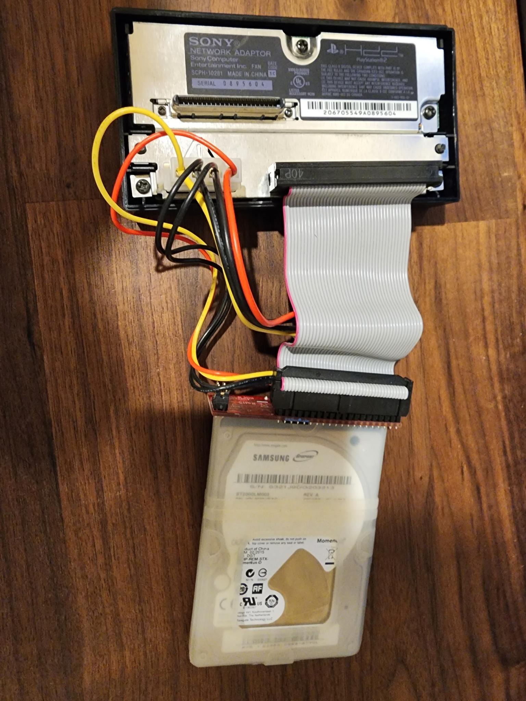

## PS2 HDD 2TB MOD

### The Physical

This is way more frustrating than it should be so I'm going to document it.

The 3rd party adaptors like the Gamestar and such don't have functioning network ports and have weird issues at times and at one point they just didn't work with OPL at all.

Save yourself the trouble and get the official adaptor, don't bother with the upgrade board to SATA either they've also got weird issues and a pretty shoddy mounting system.

StarTech.com 40-Pin IDE to SATA adaptors works perfectly with any drive, in any system I use the same thing in my OG Xbox.

There's not a lot of room to work in the OG PS2, so you also need a short IDE extension cable to go between the network adaptor and the StarTech adaptor.

At the time I did this, I was convinced using an SSD was a bad idea due to the fact the PS2 has no TRIM support and they were still pretty expensive, really this doesn't matter. So a Samsung QVO 2TB would work great.

Or just a cheap 2TB 2.5 inch laptop HDD, I had one so I used that with a 2.5in Silicone Laptop Hard Drive Protector from StarTech to keep it from moving around.

You cannot use a 3.5 inch drive with this method.

That's how you can connect it all up, nice and easy and it'll work flawlessly.

Took me a while to figure all that mess out, mostly because I doubled down on trying to use the Gamestar then tried to use the upgrade board... Just don't.

--------------------------

## Install FreeMCBoot / Hard Drive Formatting

If you save yourself the trouble of having to get FreeMcBoot onto the MC by buying one pre-flashed that's probably ideal.

Quickly this is how you can do it without buying a pre-flashed MC.

- Grab https://www.ps2-home.com/forum/download/file.php?id=12450
- Use RawHDDCopy to copy the included image over to the 2TB drive.
- Grab the latest FreeMcBoot installer, put it onto a USB formatted as FAT32, you'll need an old small USB or it may not work even if you use something to force format FAT32.
- Put an official PS2 memory card, the USB and the 2TB HDD into the PS2.
- You'll be greeted with FreeHDBoot, open the ELF loader, go to the memory card fire the installer, install FreeMcBoot to the memory card, reboot
- Done

Now fixing the hard drive, DO NOT use WinHIP it doesn't support 2TB drives it's buggy, it's garbage. Don't use any software people recommend none of it works, you'll waste your time like I did.

Instead do this.

- From FreeMcBoot open up the ELF Loader
- Go to Misc
- Go to Hard drive manager
- Find the hard drive, and hit format
- Takes ages, once it's done shut the PS2 down
- Remove the drive, back into your PC

### Loading Games for OPL

Again, do not use WinHIP, do not use HDL Dump GUI Helper, they're all crap either the drive wont show up, or they don't support 2TB or have some weird game limit.

If you're adapt enough use hdl_dump directly via CLI, it works perfectly on any OS and it's fast.

If you're on Windows use HDLBATCH (just calls hdl_dump), drop all the ISOs and CUEs into the folder hit it and walk away, it just works and even picks the correct Game ID for you without that OPL will give you a white screen on launch.

That's it really, I wanted to document this since I wasted so much time with the 3rd party adaptors and crap software like WinHIP.
